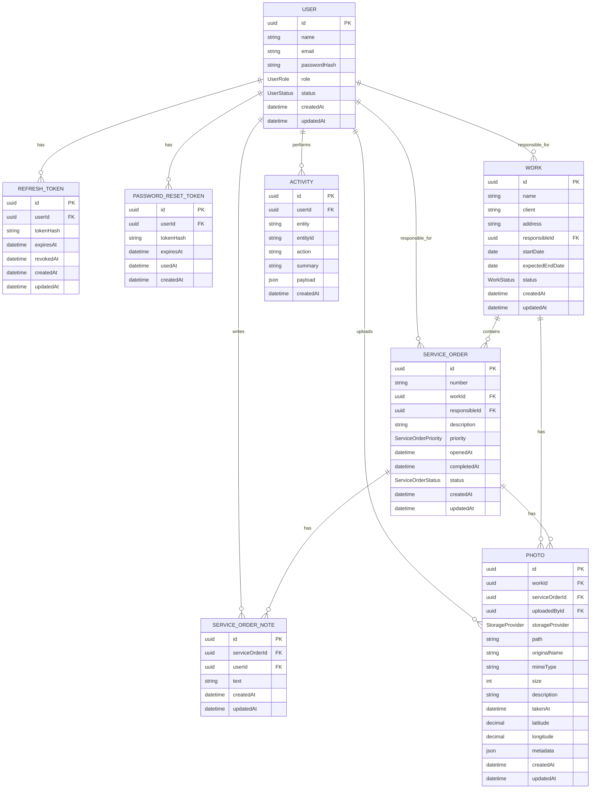

# Modelagem de Banco - Obra Prime Web

## Entidades

### User

- id
- name
- email
- passwordHash
- role
- status
- createdAt
- updatedAt

### RefreshToken

- id
- userId
- tokenHash
- expiresAt
- revokedAt
- createdAt
- updatedAt

### PasswordResetToken

- id
- userId
- tokenHash
- expiresAt
- usedAt
- createdAt

### Work

- id
- name
- client
- address
- responsibleId
- startDate
- expectedEndDate
- status
- createdAt
- updatedAt

### ServiceOrder

- id
- number
- workId
- responsibleId
- description
- priority
- openedAt
- completedAt
- status
- createdAt
- updatedAt

### ServiceOrderNote

- id
- serviceOrderId
- userId
- text
- createdAt
- updatedAt

### Photo

- id
- workId
- serviceOrderId
- uploadedById
- storageProvider
- path
- originalName
- mimeType
- size
- description
- takenAt
- latitude
- longitude
- metadata
- createdAt
- updatedAt

### Activity

- id
- userId
- entity
- entityId
- action
- summary
- payload
- createdAt

## Enums

### UserRole

- ADMIN
- ENGINEER
- FIELD_TECHNICIAN

### UserStatus

- ACTIVE
- INACTIVE

### WorkStatus

- PLANNING
- IN_PROGRESS
- PAUSED
- COMPLETED

### ServiceOrderStatus

- OPEN
- IN_EXECUTION
- WAITING_APPROVAL
- FINISHED

### ServiceOrderPriority

- A definir antes da implementacao.

### StorageProvider

- LOCAL
- S3

## Relacionamentos

- User 1:N RefreshToken
- User 1:N PasswordResetToken
- User 1:N Work como responsavel
- User 1:N ServiceOrder como responsavel
- User 1:N Photo como autor do upload
- User 1:N Activity
- Work 1:N ServiceOrder
- Work 1:N Photo
- ServiceOrder 1:N ServiceOrderNote
- ServiceOrder 1:N Photo

## Diagrama ER Mermaid

